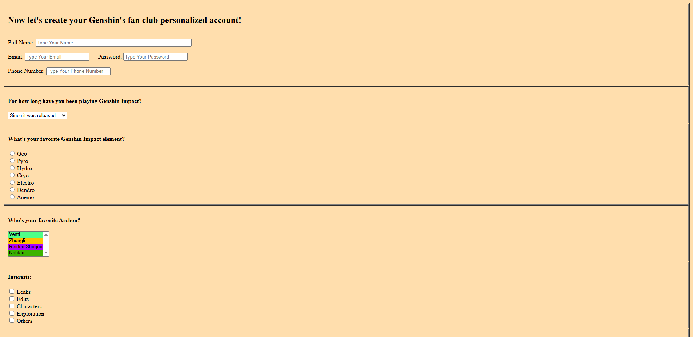

# Genshin Fan Club Form 

This project was created as a **college assignment** to practice foundational HTML and CSS skills.  
The form is themed around the popular game *Genshin Impact* and includes colorful, interactive inputs that allow users to simulate joining a fictional fan club.

---

## Project Overview

This HTML/CSS formulary includes:
- Custom-colored radio buttons for each Genshin element (Geo, Pyro, Hydro, etc.)
- Archon selector with background colors matching their elements
- Checkbox options for user interests
- Text area for feedback
- JavaScript alert simulating a successful submission

> **Note:** This form is static and does not submit data anywhere. A JavaScript `alert()` message is shown when the user clicks **Submit**.

---

## Tools Used

- HTML5
- CSS3
- JavaScript (for submit popup)

---

## Preview
 
  
_You can also open `index.html` in your browser to interact with the form._

---

## How to Use

1. Clone or download the repo
2. Open `index.html` in your browser
3. Explore the layout and hover interactions

---

## Conclusion

This project served as a fun and creative way to apply fundamental HTML and CSS skills in a themed context.  
It demonstrates attention to detail, visual creativity, and user interactivity, perfect for a beginner portfolio piece.  

Future improvements could include form validation, real submissions, and improved mobile responsiveness.

Thank you for checking out my project!

